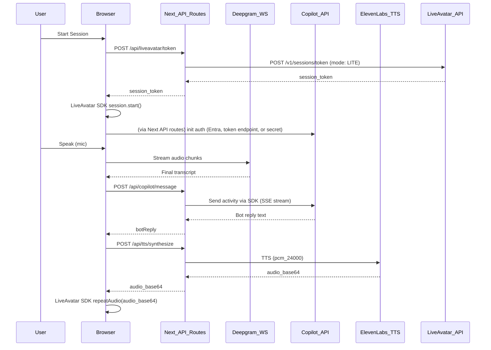

# LiveAvatar + Copilot Studio (Next.js)

Connect a **HeyGen LiveAvatar (LITE mode)** to a **Microsoft Copilot Studio** agent for conversation, with:

- **Deepgram** for real-time speech-to-text (STT)
- **ElevenLabs** for text-to-speech (TTS)
- **`@heygen/liveavatar-web-sdk`** for session management + avatar video rendering

The app renders the avatar video in the browser, listens to your mic, sends transcripts to Copilot Studio, converts the reply to PCM audio (ElevenLabs), and drives the avatar lip-sync by calling `repeatAudio()` on the LiveAvatar SDK session.

## Architecture



## Prerequisites

- **Node.js + npm** (recommended: Node 18+)
- Accounts/keys for:
  - **HeyGen LiveAvatar** (API key + avatar id)
  - **Deepgram** (API key)
  - **ElevenLabs** (API key + voice id)
- **Microsoft Copilot Studio** configured with one of:
  - Entra ID authenticated conversational API access
  - Token endpoint URL
  - Direct Line secret
- Browser requirements:
  - Mic permissions enabled
  - WebRTC + MediaRecorder support
  - For mic capture, HTTPS is typically required except on `localhost`

## Environment Variables

Create a `.env.local` (recommended) and set the following.

> **Security warning**: Never commit secrets. Use `.env.local` (gitignored) for real keys. `.env.example` is the safe, committable template.

| Variable | Required | Used by | Notes |
|---|---:|---|---|
| `LIVEAVATAR_API_KEY` | ✅ | Server | Header `X-API-KEY` for LiveAvatar token creation |
| `LIVEAVATAR_AVATAR_ID` | ✅ | Server | Avatar identifier |
| `LIVEAVATAR_API_URL` | ⛔️ | Server | Defaults to `https://api.liveavatar.com` |
| `LIVEAVATAR_IS_SANDBOX` | ⛔️ | Server | Defaults to `true` in code; set `false` for production |
| `NEXT_PUBLIC_LIVEAVATAR_API_URL` | ⛔️ | Client | SDK `apiUrl` override; defaults to `https://api.liveavatar.com` |
| `DEEPGRAM_API_KEY` | ✅ | Server | Returned by `/api/deepgram/token` (see Security Notes) |
| `ELEVENLABS_API_KEY` | ✅ | Server | Used by `/api/tts/synthesize` |
| `ELEVENLABS_VOICE_ID` | ✅ | Server | ElevenLabs voice id |
| `ELEVENLABS_MODEL_ID` | ⛔️ | Server | Defaults to `eleven_flash_v2_5` |
| `COPILOT_ENVIRONMENT_ID` | ⛔️ | Server | Power Platform environment id (e.g. `Default-<tenant-id>`) |
| `COPILOT_AGENT_SCHEMA_NAME` | ⛔️ | Server | Copilot Studio agent schema name |
| `ENTRA_TENANT_ID` | ⛔️ | Server | Entra tenant id for OAuth client credentials |
| `ENTRA_CLIENT_ID` | ⛔️ | Server | Entra app registration client id |
| `ENTRA_CLIENT_SECRET` | ⛔️ | Server | Entra app registration client secret |
| `ENTRA_SCOPE` | ⛔️ | Server | Optional; defaults to `https://api.powerplatform.com/.default` |
| `COPILOT_DEBUG` | ⛔️ | Server | Set `true` to include extra Entra/Copilot diagnostics in error responses |
| `COPILOT_TOKEN_ENDPOINT` | ⛔️ | Server | Token endpoint URL (`GET`), used when Entra vars are not configured |
| `COPILOT_DIRECTLINE_SECRET` | ⛔️ | Server | Direct Line secret (`POST /tokens/generate`) fallback |
| `NEXT_PUBLIC_APP_TITLE` | ⛔️ | Client | UI title |

Example `.env.local`:

```env
# LiveAvatar / HeyGen
LIVEAVATAR_API_KEY=your_liveavatar_api_key
LIVEAVATAR_AVATAR_ID=your_avatar_id
LIVEAVATAR_API_URL=https://api.liveavatar.com
LIVEAVATAR_IS_SANDBOX=true
NEXT_PUBLIC_LIVEAVATAR_API_URL=https://api.liveavatar.com

# Deepgram (STT)
DEEPGRAM_API_KEY=your_deepgram_api_key

# ElevenLabs (TTS)
ELEVENLABS_API_KEY=your_elevenlabs_api_key
ELEVENLABS_VOICE_ID=your_voice_id
ELEVENLABS_MODEL_ID=eleven_flash_v2_5

# Microsoft Copilot Studio auth options (priority order)
# 1) Official SDK (Entra ID)
COPILOT_ENVIRONMENT_ID=Default-your-tenant-id
COPILOT_AGENT_SCHEMA_NAME=your_agent_schema_name
ENTRA_TENANT_ID=your_tenant_id
ENTRA_CLIENT_ID=your_entra_app_client_id
ENTRA_CLIENT_SECRET=your_entra_client_secret
# ENTRA_SCOPE=https://api.powerplatform.com/.default
# COPILOT_DEBUG=true

# 2) Token endpoint fallback (used only if Entra values are not set)
# COPILOT_TOKEN_ENDPOINT=https://your-token-endpoint-from-copilot-studio

# 3) Direct Line secret fallback (used only if Entra and token endpoint are not set)
# COPILOT_DIRECTLINE_SECRET=your_directline_secret

# Optional public settings
NEXT_PUBLIC_APP_TITLE=LiveAvatar Copilot
```

## Quick Start

```bash
npm install
cp .env.example .env.local   # then fill in your real keys
npm run dev
```

Then open the local dev URL printed by Next.js.

Recommended first-run validation:

- Click **Start Session** (avatar video should appear).
- Use **Manual text test** to send a message (Copilot reply should appear in the transcript).
- Toggle the mic (**Start Listening**) and speak a short sentence (final transcript triggers a full turn).

## UI Guide

The main UI is implemented in `src/components/AvatarSession.tsx` and includes:

- **Start Session**: Creates a LiveAvatar LITE session token, starts the SDK session, and initializes Copilot using the configured auth method.
- **Stop Session**: Stops STT, stops avatar listening, stops the SDK session, and resets conversation state.
- **Interrupt**: Calls `interrupt()` on the SDK session to stop current speech.
- **Start/Stop Listening**: Toggles Deepgram STT streaming from your mic.
- **Manual text test**: Sends typed text through Copilot → TTS → avatar speak (useful before mic testing).
- **Run Configuration Check**: Runs per-vendor health checks (LiveAvatar, Deepgram, ElevenLabs, Copilot) and shows missing env vars, errors, hints, and where to get each key/setting.

## Local API Routes

All external calls are made server-side via Next.js routes under `src/app/api/`.

### `POST /api/liveavatar/token`

Returns a LITE mode session token.

- **Response**: `{ "session_token": string, "session_id"?: string }`

### `POST /api/copilot/token`

Initializes Copilot using this priority order:

- If a delegated Entra token (MSAL) is in the `Authorization` header and `COPILOT_ENVIRONMENT_ID` + `COPILOT_AGENT_SCHEMA_NAME` are set:
  - Start conversation via official Copilot Studio SDK
  - Return `token: "entra-delegated"` and `method: "entra-delegated"`
- Else if SDK config + server-side Entra vars are set (`ENTRA_TENANT_ID`, `ENTRA_CLIENT_ID`, `ENTRA_CLIENT_SECRET`):
  - Acquire Entra bearer token server-side
  - Start conversation via official Copilot Studio SDK
  - Return `token: "entra-managed"` and `method: "entra"`
- Else if `COPILOT_TOKEN_ENDPOINT` is set:
  - `GET` token endpoint URL
  - Return `method: "directline"`
- Else if `COPILOT_DIRECTLINE_SECRET` is set:
  - `POST` Direct Line `tokens/generate`
  - Return `method: "directline"`

- **Response**: `{ "token": string, "expires_in"?: number, "conversationId"?: string, "method"?: "entra" | "entra-delegated" | "directline" }`
- **Error diagnostics**: when `COPILOT_DEBUG=true`, Entra/Copilot failures include safe diagnostics (`status`, endpoint host/path, request/correlation ids, token claims like `aud/tid/appid/scp/roles/exp`).

### `POST /api/copilot/conversation`

Starts a Direct Line conversation.

- **Body**: `{ "token": string }`
- **Response**: `{ "conversationId": string, "token"?: string, "streamUrl"?: string }`

### `POST /api/copilot/message`

Sends a user message and gets a bot reply. The route automatically uses the official SDK (Entra) or Direct Line based on `method`.

- **Body**: `{ "method"?: "entra" | "entra-delegated" | "directline", "token"?: string, "conversationId": string, "text": string, "watermark"?: string }`
- **Response**: `{ "botReply": string }`

### `POST /api/tts/synthesize`

ElevenLabs TTS using the `with-timestamps` endpoint and `output_format=pcm_24000`.

- **Body**: `{ "text": string }`
- **Response**: `{ "audio": string }` where `audio` is base64-encoded PCM.

### `POST /api/deepgram/token`

Returns a Deepgram token for browser STT.

- **Response**: `{ "token": string }`

### `POST /api/diagnostics/vendors`

Runs vendor configuration probes and returns one result per vendor:

- `liveavatar`: validates env vars and session token probe
- `deepgram`: validates API key via Deepgram projects endpoint
- `elevenlabs`: validates API key and checks configured voice id exists
- `copilot`: validates currently configured auth mode (Entra, token endpoint, or Direct Line secret)

- **Response**:
  ```json
  {
    "results": [
      {
        "vendor": "copilot",
        "status": "fail",
        "authMode": "entra",
        "error": "Copilot conversation request failed: HTTP 403",
        "hint": "Check Entra admin consent, app permissions, and token audience/scope.",
        "whereToGetIt": "Azure Portal -> Entra ID -> App registrations -> Overview + Certificates & secrets"
      }
    ]
  }
  ```
  Status values are `pass`, `warn`, or `fail`. Debug-only details are included when `COPILOT_DEBUG=true`.

## Security + Production Notes

- **Deepgram key exposure**: `/api/deepgram/token` currently returns the full `DEEPGRAM_API_KEY` to the browser for client-side WebSocket STT. This is acceptable for demos, but **not recommended for production**. For production, use short-lived scoped credentials or proxy the Deepgram stream through your backend.
- **Entra tokens**: Entra bearer tokens are fetched and cached server-side only; they are never returned to the browser.
- **Direct Line token expiry**: Direct Line tokens expire (often ~30 minutes). The current client flow does not refresh tokens during long sessions.
- **Dependency versions**: `package.json` uses `\"latest\"` for dependencies; pin versions for production stability.
- **Secrets**: Keep real credentials only in `.env.local` (gitignored). The committed `.env.example` contains safe placeholders only.

## Roadmap / Known Gaps

- **Deepgram hardening**: replace `/api/deepgram/token` with scoped, short-lived credentials or a backend streaming proxy.
- **Token refresh**: implement Direct Line refresh + retry flow for long sessions.
- **Observability**: add structured logs + correlation ids for turn-level tracing (STT → Copilot → TTS → speak).
- **Pin dependency versions**: replace `"latest"` in `package.json` with fixed versions after first install.

## Troubleshooting

- **Avatar video never appears**: confirm `LIVEAVATAR_API_KEY`, `LIVEAVATAR_AVATAR_ID`, and `LIVEAVATAR_IS_SANDBOX`. Check the server logs for `/api/liveavatar/token` errors.
- **Copilot auth fails**: check auth priority. If any Entra variable is set, all required Entra variables must be set. If you are not using Entra, leave all Entra variables unset and configure `COPILOT_TOKEN_ENDPOINT` or `COPILOT_DIRECTLINE_SECRET`.
- **Copilot 403 checklist (Entra mode)**:
  1. Confirm app registration tenant matches `ENTRA_TENANT_ID`.
  2. Confirm `ENTRA_CLIENT_ID` and `ENTRA_CLIENT_SECRET` are valid (not expired).
  3. In Azure App Registration, verify required API permissions are added and **admin consent is granted**.
  4. Enable `COPILOT_DEBUG=true`, call `POST /api/copilot/token`, and inspect diagnostics:
     - `diagnostics.endpoint` should target your Power Platform environment host/path.
     - `diagnostics.status` should show the failing HTTP code.
     - token claims should show expected `aud`, `tid`, and app identity (`appid`/`azp`).
  5. If `aud`/scope are unexpected, check `ENTRA_SCOPE` (default is `https://api.powerplatform.com/.default`).
  6. If only Entra path fails and Direct Line works, issue is usually tenant consent or permission mapping for the authenticated Copilot API.
- **No mic transcription**: ensure mic permissions are granted and the page is served over `https` (or `localhost`). Check browser console for MediaRecorder errors.
- **ElevenLabs TTS fails**: verify `ELEVENLABS_API_KEY` and `ELEVENLABS_VOICE_ID`. Ensure your ElevenLabs plan supports the requested output format.

## Repo Layout

```
src/
  app/
    api/                 # Next.js API routes for LiveAvatar, Copilot, Deepgram, ElevenLabs
    page.tsx             # Renders AvatarSession
  components/            # UI components
  hooks/                 # LiveAvatar session, STT, Copilot, and conversation orchestration hooks
  lib/                   # Direct Line + Entra auth helpers + shared types
```

